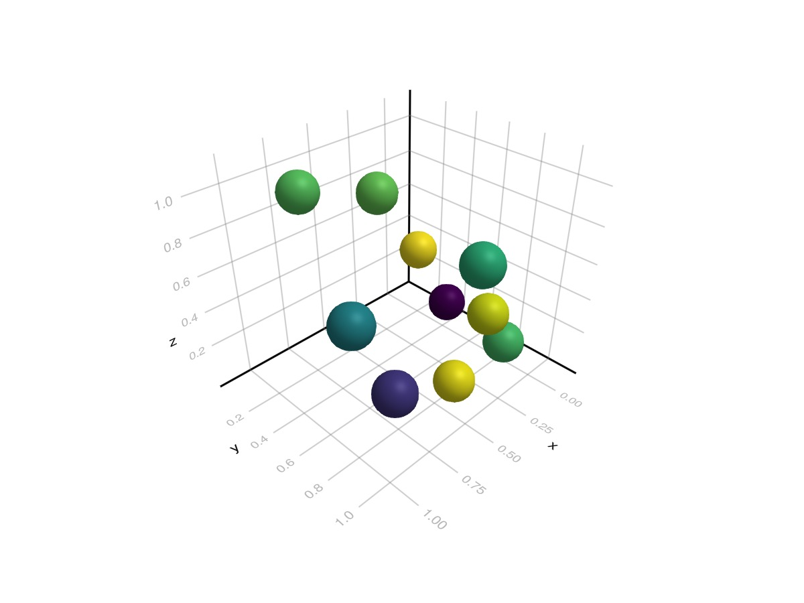
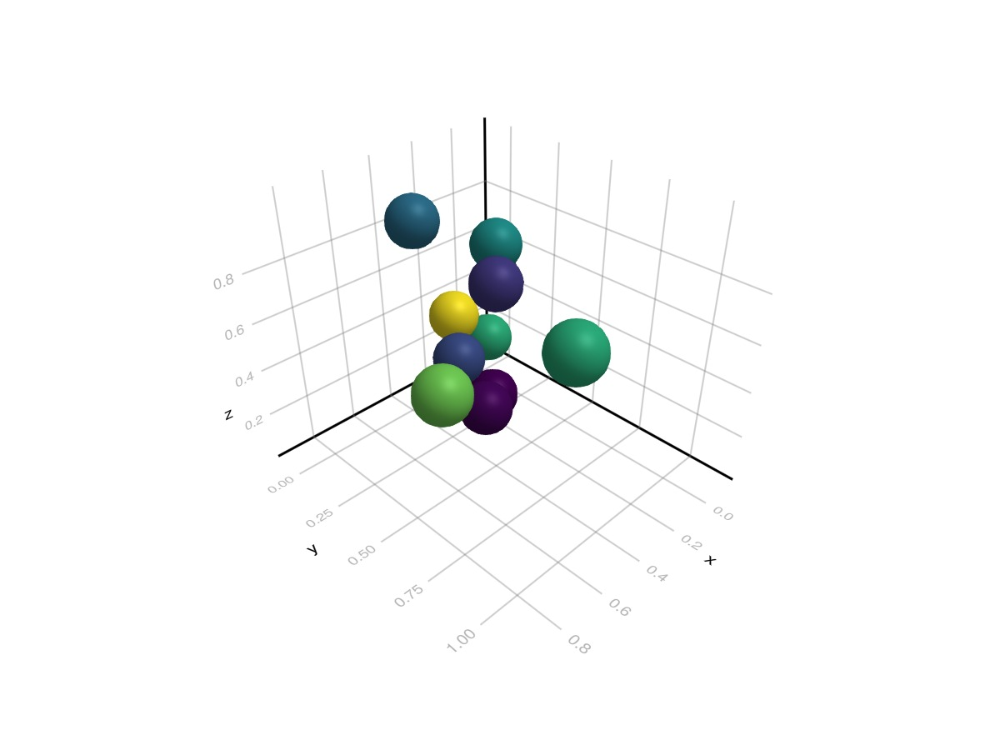
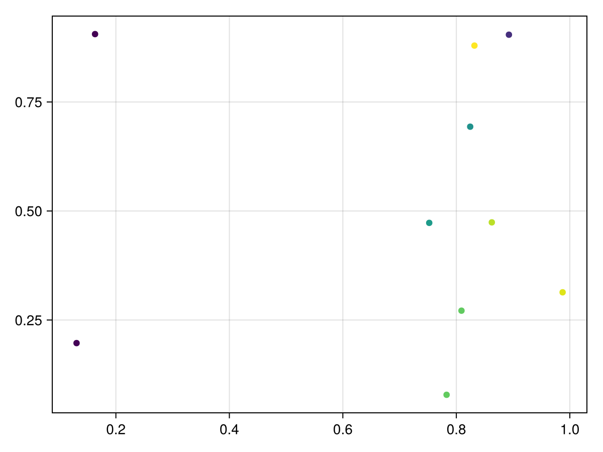
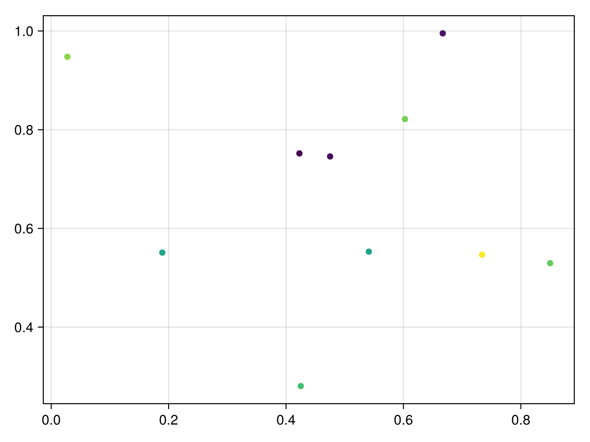

# Plotting outputs {#Plotting-outputs}

## GLMakie {#GLMakie}

```julia
using GLMakie
GLMakie.activate!()
meshscatter(rand(Point3f,10); color=rand(10))
```



```julia
GLMakie.activate!()
fig, ax, obj = meshscatter(rand(Point3f,10); color=rand(10))
fig
```



## CairoMakie {#CairoMakie}

```julia
using CairoMakie
CairoMakie.activate!(type = "svg")
scatter(rand(Point2f,10); color=rand(10))
```



```julia
CairoMakie.activate!(type = "svg")
fig, ax, obj = scatter(rand(Point2f,10); color=rand(10))
fig
```



```julia
CairoMakie.activate!(type = "png")
fig, ax, obj = scatter(rand(Point2f,10); color=rand(10))
fig
```


